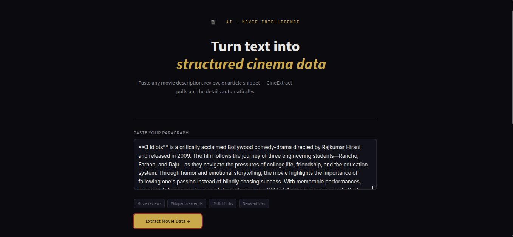
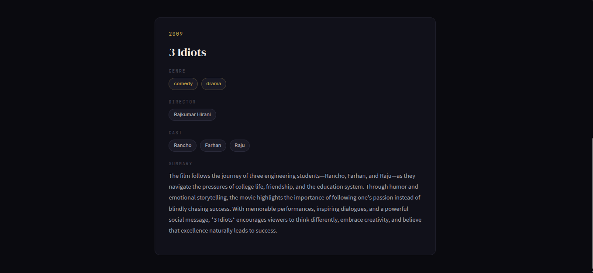

# 🎬 SyntaxIQ – AI-Powered Movie Information Extractor

SyntaxIQ is a Generative AI application that transforms unstructured movie descriptions into structured movie information using **LangChain**, **Mistral AI**, **Pydantic**, and **Streamlit**. By leveraging the capabilities of Large Language Models (LLMs), the application intelligently extracts key movie details from natural language paragraphs and presents them in a clean, structured format.

---

## 🚀 Features

* 🎬 Extract structured movie information from natural language paragraphs
* 🤖 Powered by Mistral AI using LangChain
* 🧠 Intelligent information extraction through prompt engineering
* 📋 Structured output using Pydantic models
* 💻 Interactive Streamlit-based web interface
* ⚡ Real-time AI-powered responses
* ✨ Clean and intuitive user experience

---

## 📸 Application Preview

### 📝 Movie Paragraph Input

Provide a movie description in natural language. The application processes the paragraph and prepares it for AI-powered information extraction.


---

### 🎬 Extracted Movie Information

The application analyzes the paragraph and extracts structured movie details, including title, director, cast, genre, release year, language, duration, rating, and plot summary.


---

## 🛠️ Tech Stack

* Python
* Streamlit
* LangChain
* Mistral AI
* Pydantic
* Python Dotenv

---

## 📂 Project Structure

```text
SyntaxIQ-Movie-Information-Extractor
│
├── core.py
├── UI_core.py
│
├── Screenshots
│   ├── movie-paragraph-input.png
│   └── movie-information-output.png
│
├── requirements.txt
├── README.md
└── .gitignore
```

---

## ⚙️ Installation

### 1. Clone the Repository

```bash
git clone https://github.com/your-username/SyntaxIQ-Movie-Information-Extractor.git
```

### 2. Navigate to the Project Directory

```bash
cd SyntaxIQ-Movie-Information-Extractor
```

### 3. Create a Virtual Environment

```bash
python -m venv .venv
```

### 4. Activate the Virtual Environment

#### Windows

```bash
.venv\Scripts\activate
```

#### Linux / macOS

```bash
source .venv/bin/activate
```

### 5. Install Dependencies

```bash
pip install -r requirements.txt
```

---

## 🔑 Environment Variables

Create a `.env` file in the project root directory and add your Mistral API key.

```env
MISTRAL_API_KEY=your_mistral_api_key
```

---

## ▶️ Run the Application

```bash
streamlit run UI_core.py
```

After launching, open your browser and visit:

```text
http://localhost:8501
```

---

## 🔄 Workflow

1. Enter a movie description or paragraph.
2. The input is processed by LangChain and sent to the Mistral AI model.
3. Prompt engineering guides the model to identify important movie information.
4. Pydantic validates and structures the extracted data.
5. The structured movie information is displayed through the Streamlit interface.

---

## 📋 Information Extracted

The application can extract:

* 🎬 Movie Title
* 🎥 Director
* ⭐ Cast
* 🎭 Genre
* 📅 Release Year
* 🌍 Language
* ⏱️ Duration
* ⭐ Rating (when available)
* 📝 Plot Summary

---

## 🎯 Learning Outcomes

This project demonstrates practical implementation of:

* Generative AI Applications
* Large Language Models (LLMs)
* LangChain Framework
* Prompt Engineering
* Structured Output with Pydantic
* AI-based Information Extraction
* Streamlit Web Application Development

---

## 🚀 Future Enhancements

* 🎞️ IMDb API Integration
* 🖼️ Movie Poster Retrieval
* 🌐 Multi-language Support
* 📄 Export Results as PDF or CSV
* 📚 Support for TV Shows and Web Series
* 🤖 RAG-based Movie Knowledge Enhancement
* 🎙️ Voice-based Input

---

## 👩‍💻 Author

**Tanushri Kalaskar**

B.Tech Information Technology Student

Passionate about Artificial Intelligence, Machine Learning, and Generative AI.

---

## ⭐ Support

If you found this project useful, consider giving it a ⭐ on GitHub.
